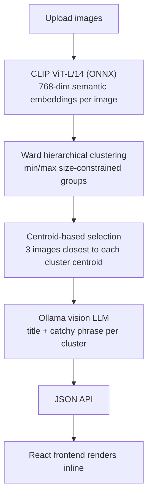
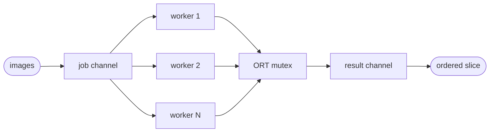
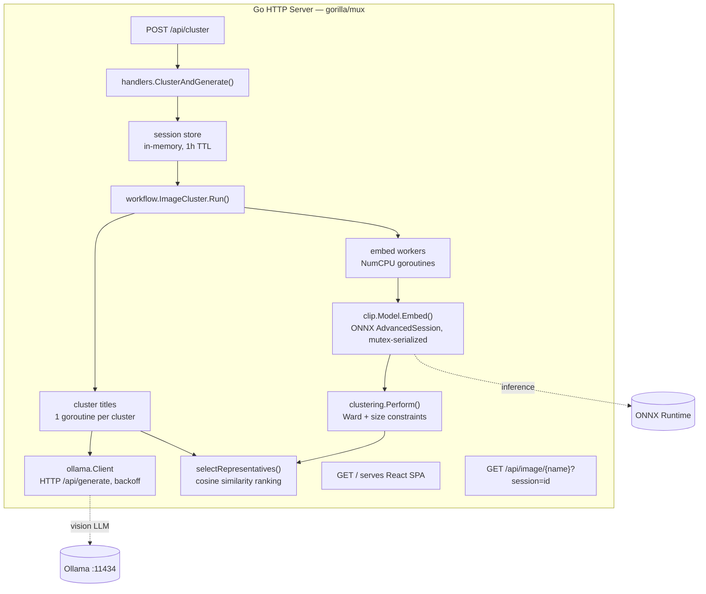

# imageclust

[](https://github.com/monahand1023/imageclust/actions/workflows/ci.yml) [](https://github.com/monahand1023/imageclust/releases) [](https://go.dev/) [](https://react.dev/) [](.) [](LICENSE)

Semantic image clustering that runs entirely on your local machine. Upload a collection of photos, get back labeled groups organized by what they're *about* — not just visual similarity.

Clusters 20 images in ~50 seconds on an M4 Mac Mini (no GPU, no cloud).

---

## How it works



---

## Technical deep dive

### CLIP embeddings

[CLIP (Contrastive Language–Image Pre-training)](https://openai.com/research/clip) is an OpenAI model trained on 400 million (image, text) pairs using a contrastive objective: the image encoder and text encoder are trained jointly so that matching pairs have high cosine similarity in a shared embedding space.

This project uses the vision-only half: **CLIP ViT-L/14** in ONNX format from [Xenova/clip-vit-large-patch14](https://huggingface.co/Xenova/clip-vit-large-patch14). The model takes a 224×224 image and produces a **768-dimensional vector**. Each dimension encodes abstract semantic content learned from the web-scale training data.

**Why CLIP over alternatives:**

| Model | Training objective | Best for | Weakness here |
|-------|--------------------|----------|---------------|
| CLIP ViT-L/14 | Contrastive (image + text) | Semantic concept clustering | Slightly slower than smaller models |
| ResNet-50/101 | ImageNet classification | Visual feature extraction | Groups visually similar, not semantically similar images |
| DINOv2 | Self-supervised distillation | Re-identification, fine-grained similarity | No semantic grounding from text |
| CLIP ViT-B/32 | Contrastive (image + text) | Faster alternative | 512-dim, lower capacity than L/14 |

CLIP's contrastive training means images of the same *concept* cluster together even when they look different visually — a photograph of a dog and a cartoon of a dog end up near each other; two photographs of different fields of grass do too.

#### Image preprocessing

Before inference, each image is put through the standard CLIP preprocessing pipeline:

1. **Resize** to 224×224 using **CatmullRom interpolation** (Lanczos-quality bicubic, implemented via `golang.org/x/image/draw`) — better edge preservation than bilinear at a moderate cost.
2. **Channel layout** — pixel values are rearranged from HWC (height × width × channels) to **NCHW** (batch × channels × height × width), which is what the ONNX model expects.
3. **Normalization** — each channel is normalized with CLIP's specific mean and std:

```
R: (pixel/255 - 0.48145466) / 0.26862954
G: (pixel/255 - 0.45782750) / 0.26130258
B: (pixel/255 - 0.40821073) / 0.27577711
```

4. **L2 normalization** — the output 768-dim vector is L2-normalized so all embeddings lie on the unit hypersphere. This means **cosine similarity = dot product**, which simplifies downstream distance math.

#### Inference implementation

The ONNX session is wrapped in a `Model` struct with pre-allocated input/output tensors (`3×224×224` float32 in, `768` float32 out). Tensor memory is shared between Go and the C ONNX Runtime via a backing slice, avoiding allocations on the hot path. A `sync.Mutex` serializes all calls into the single ORT session — ONNX Runtime itself is thread-safe per-session, but the backing-slice reuse pattern requires exclusive access during inference.

---

### Ward hierarchical clustering

Clustering is done via **agglomerative hierarchical clustering using Ward's linkage criterion**, implemented from scratch in Go. The algorithm runs on the L2-normalized CLIP embeddings.

#### Why agglomerative / bottom-up

The algorithm starts with each image as its own cluster and iteratively merges the two closest clusters until reaching the target number of clusters. This is the opposite of divisive approaches (start with one cluster, split down). Agglomerative methods produce a dendrogram — a tree of all possible merge decisions — and you cut it at any depth.

#### Ward's linkage criterion

Ward's method minimizes the **total within-cluster variance** at each merge step. The distance between two clusters A and B under Ward's criterion is:

```
d(A, B) = (|A| * |B|) / (|A| + |B|) * ||centroid(A) - centroid(B)||²
```

Where `|A|` and `|B|` are cluster sizes. The size-weighting term means Ward penalizes merges that would create large, spread-out clusters — it naturally produces compact, similarly-sized groups. This is better than single-linkage (which produces chains) or complete-linkage (which can break apart natural groups).

Centroid updates are computed incrementally as a weighted average of the two merged centroids:

```
centroid(merged) = (|A|*centroid(A) + |B|*centroid(B)) / (|A| + |B|)
```

#### Size-constrained clustering

Standard Ward clustering doesn't support min/max cluster size constraints. imageclust enforces them with a two-phase approach:

**Phase 1 — target cluster count:**

Given `totalImages`, `minSize`, and `maxSize`, the feasible range of cluster counts is:

```
nMin = ceil(totalImages / maxSize)   # fewest clusters that fit under maxSize
nMax = floor(totalImages / minSize)  # most clusters that fit above minSize
nTarget = (nMin + nMax) / 2          # midpoint heuristic
```

**Phase 2 — merge-time max enforcement:**

During agglomeration, before each merge, the algorithm checks whether `|A| + |B| > maxSize`. If it would exceed the limit, that pair is marked as non-mergeable (distance set to `math.MaxFloat32`) and the next-closest pair is tried instead.

Because every merge is guarded this way, no cluster can ever exceed `maxSize` — no post-hoc splitting is needed.

**Phase 3 — min enforcement:**

Clusters smaller than `minSize` after all merges are reported as `unclustered` in the API response rather than silently dropped — every uploaded image is accounted for.

#### Complexity

- Initial distance matrix: O(n²) pairwise Ward distances
- Each merge iteration: O(n²) scan to find the minimum (naive; a priority queue would give O(n log n) but n is small here)
- Overall: O(n³) in the worst case — negligible for the image counts this tool is designed for

---

### Representative image selection

After clustering, the pipeline needs to pick 3 images per cluster to send to the vision LLM for labeling. It selects the images **closest to the cluster centroid** using cosine similarity.

Since all embeddings are L2-normalized (unit vectors), cosine similarity equals the dot product:

```
cosine_sim(image, centroid) = image · centroid  (when both are unit vectors)
```

The centroid is computed as the mean of the cluster's embedding vectors, then L2-normalized. The top-k images by dot product score are selected via partial selection sort (O(n·k) — fine for small n).

This ensures the most "representative" images go to the LLM — the ones that best capture the semantic center of the cluster — rather than random picks or outliers.

---

### Ollama vision LLM

Each cluster is labeled by sending its representative images to a locally-running vision model via the **Ollama REST API** (`/api/generate`). Images are base64-encoded and embedded in the request body.

The prompt asks the model to return strict JSON:

```json
{"title": "short title here", "catchy_phrase": "catchy phrase here"}
```

Title is capped at 25 characters; catchy phrase at 100.

**Retry logic** uses exponential backoff with jitter:

```
backoff(attempt) = initialBackoff * 2^attempt * (1 + 0.3 * rand())
```

Starting at 2 seconds, capped at 30 seconds, with up to 3 attempts. Jitter prevents thundering-herd if multiple clusters retry simultaneously.

**Supported vision models** (via Ollama):

| Model | Size | Speed | Quality | Pull command |
|-------|------|-------|---------|-------------|
| `llava:7b` | 4.7 GB | Fast | Good | `ollama pull llava:7b` |
| `llama3.2-vision:11b` | 8.0 GB | Medium | Better | `ollama pull llama3.2-vision:11b` |
| `moondream` | 1.7 GB | Fastest | Lower | `ollama pull moondream` |

Set `OLLAMA_MODEL` to switch. `llava:7b` is the best speed/quality tradeoff for most use cases.

**Context propagation** — the request's `context.Context` is forwarded through to each Ollama HTTP call, so if the user cancels the browser request, in-flight LLM work is aborted cleanly.

---

### Concurrency model

The pipeline has two parallel stages:

**CLIP embedding (worker pool):**

A bounded goroutine pool of `runtime.NumCPU()` workers fans out across all images. Each worker calls `Model.Embed()`, which preprocesses the image concurrently (decode, resize, normalize) and then acquires the mutex for the ORT session. The bottleneck is the single serialized inference session, so more workers than images-in-flight provides no benefit — but preprocessing overlap does help.



**Cluster title generation (unbounded parallel):**

All clusters are titled concurrently — one goroutine per cluster. Since Ollama queues requests it can't serve immediately, this is safe. Set `OLLAMA_NUM_PARALLEL` on the Ollama server side to control how many vision inference slots it allocates.

---

## Architecture



---

## Prerequisites

**macOS:**
```bash
brew install onnxruntime ollama
ollama pull llava:7b          # 4.7 GB vision model
bash scripts/download_model.sh # ~1.2 GB CLIP model
```

**Linux:** Download ONNX Runtime from [github.com/microsoft/onnxruntime/releases](https://github.com/microsoft/onnxruntime/releases) (v1.26.0 — the release `yalue/onnxruntime_go` v1.30.1 is built against, and what the Dockerfile installs; `linux-x64` or `linux-aarch64`), extract the `.so`, set `ONNXRUNTIME_LIB_PATH`. Then install Ollama and run the model download script.

---

## Running

```bash
go build -o imageclust .
OLLAMA_MODEL=llava:7b ./imageclust
# open http://localhost:8080
```

Environment variables (all optional):

| Variable | Default | Description |
|----------|---------|-------------|
| `ONNXRUNTIME_LIB_PATH` | `/opt/homebrew/lib/libonnxruntime.dylib` | Path to ORT shared library |
| `CLIP_MODEL_PATH` | `models/clip-vit-large-patch14/vision_model.onnx` | CLIP ONNX model |
| `OLLAMA_HOST` | `http://localhost:11434` | Ollama API endpoint |
| `OLLAMA_MODEL` | `llama3.2-vision:11b` | Vision-capable model name |
| `PORT` | `8080` | HTTP listen port |

---

## Docker

The Dockerfile builds a self-contained image with the Go server and React frontend. Ollama must run on the host (or another container) — the default `OLLAMA_HOST` is `http://host.docker.internal:11434`.

Prebuilt images are published to GitHub Container Registry for linux/amd64 and linux/arm64 on every push, and tagged by release:

```bash
docker run -p 8080:8080 \
  -v /path/to/models:/app/models \
  ghcr.io/monahand1023/imageclust:latest
```

Or build it yourself:

```bash
docker build -t imageclust .
docker run -p 8080:8080 \
  -v /path/to/models:/app/models \
  imageclust
```

The CLIP model (~1.2 GB) is mounted at runtime via the volume. To bake it in instead, uncomment the `COPY models/` line in the Dockerfile.

Cross-platform builds with `--platform` work correctly (arm64 → `aarch64`, amd64 → `x64` ORT release naming).

---

## Benchmarks

Hardware: Apple M4 Pro, 14-core, 64 GB RAM. CPU inference only (no GPU/CoreML EP).

### CLIP embedding — `go test -bench=BenchmarkEmbed ./internal/clip/`

| | |
|---|---|
| Time per image | ~432 ms |
| Throughput | ~2.3 images/sec |
| Memory per call | ~3.7 MB |

Inference is serialized (one ORT session, mutex-protected). Preprocessing (decode → resize → NCHW normalization) runs in parallel across the worker pool; the ORT session is the bottleneck.

### Ward clustering — `go test -bench=. ./internal/clustering/`

| Images | Time | Memory |
|--------|------|--------|
| 10 | 0.15 ms | 0.3 MB |
| 20 | 0.54 ms | 1.2 MB |
| 50 | 3.5 ms | 7.4 MB |
| 100 | 14 ms | 29 MB |
| 200 | 55 ms | 115 MB |

O(n²) distance matrix. Negligible relative to CLIP and Ollama.

### End-to-end HTTP pipeline

| Images | Clusters | Total time | CLIP share | Ollama share |
|--------|----------|-----------|-----------|-------------|
| 10 | 2 | ~23 s | ~4 s | ~19 s |
| 20 | 4 | ~51 s | ~9 s | ~42 s |

**Bottleneck is Ollama** (~10 s/cluster, sequential per inference slot). CLIP is ~17% of total time for 20 images. To speed things up: run a smaller vision model (`llava:7b` is already fast; `moondream` is faster but lower quality), or set `OLLAMA_NUM_PARALLEL` on the server to allow concurrent cluster labeling.

---

## Project structure

```
internal/
  clip/       — CLIP ViT-L/14 ONNX inference (AdvancedSession, mutex-serialized)
  ollama/     — Direct HTTP client for Ollama /api/generate (no SDK)
  workflow/   — Pipeline orchestration: embed → cluster → title
  clustering/ — Ward hierarchical clustering with min/max size constraints
  handlers/   — HTTP layer: multipart upload, JSON API, session store
  models/     — Shared types (UploadedImage, ClusterDetails)
  utils/      — Filename sanitization
frontend/
  src/components/
    ImageUploadForm.jsx  — Upload form with drag-and-drop
    ClusterResults.jsx   — Inline cluster grid renderer
scripts/
  download_model.sh  — Fetch CLIP ONNX from HuggingFace
  benchmark.sh       — End-to-end pipeline timing script
```

---

## API

**POST /api/cluster** — multipart form

| Field | Type | Description |
|-------|------|-------------|
| `images` | file (multiple) | Image files to cluster |
| `minClusterSize` | int | Minimum images per cluster (default 3) |
| `maxClusterSize` | int | Maximum images per cluster (default 6) |

Uploads are capped at 32 MB and 200 images per request. Every uploaded image is accounted for in the response: clustered, `unclustered` (didn't fit any cluster under the size constraints), or `skipped` (couldn't be processed, e.g. an unsupported format like HEIC).

Response:
```json
{
  "status": "success",
  "sessionId": "abc123",
  "clusters": [
    {
      "id": "Cluster-0",
      "title": "Serene rural sunset",
      "catchy_phrase": "Nature's canvas of tranquility",
      "images": ["img_0.jpg", "img_3.jpg", "img_7.jpg"]
    }
  ],
  "unclustered": ["img_9.jpg"],
  "skipped": [{ "filename": "IMG_1024.heic", "error": "image: unknown format" }]
}
```

Errors use the same envelope: `{"status": "error", "error": "<message>"}`.

**GET /api/image/{filename}?session=\<sessionId\>** — serves an uploaded image. Sessions expire after 1 hour; the background cleanup goroutine removes temp directories every 10 minutes.

**GET /api/export?session=\<sessionId\>** — streams a ZIP of the session's results with one folder per cluster (`01 <Title>/…`) plus an `unclustered/` folder.

Repeat runs with the same images are fast: embeddings are cached in-process by content hash, so re-clustering with different size constraints skips CLIP inference entirely.

---

## License

MIT
